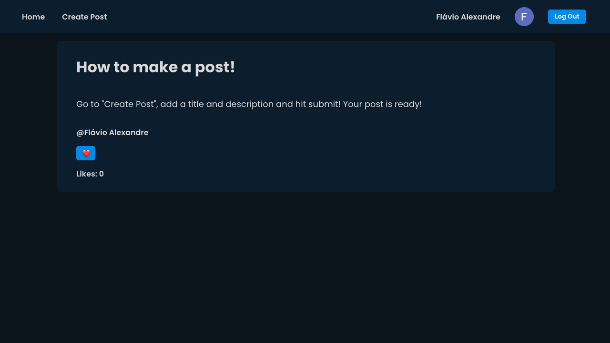

# Social Media React App
### A Social Media React App using Firebase authentication/database for post creation and user interaction through likes.
Technologies used: React, Typescript, CSS, React Hooks, Firebase.

